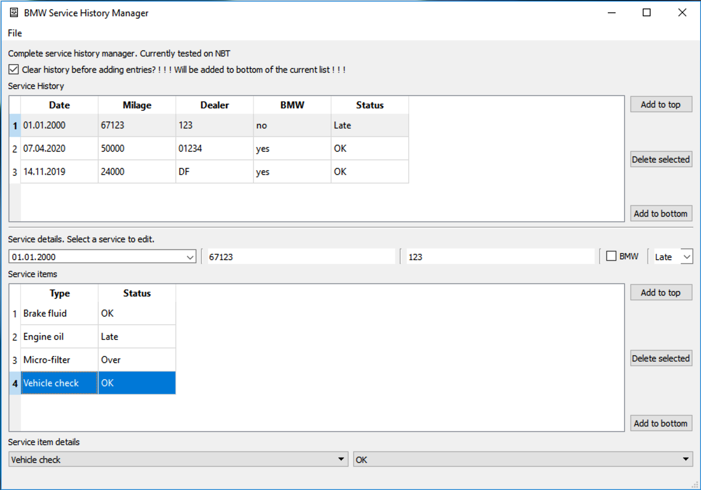

# BMW Service Manager App. 
Allows creation and managing of the BMW Service History. 

Tested on NBT ECU only. May or may not work on CIC / NBT Evo.

## Releases

Check the [latest release](https://github.com/theDeniZ/ServiceManager/releases/latest) page. You will find there some binaries and release notes.

## Create and manage the history file

The Service History is a file with a *.tst extension (also a `Ediabas Toolset 32` Test file). You can load an existing one or create a new file.

UI is intuitive: 
- Select the flag at the very top to clear the history before adding entries (in the car itself). This will cause the history to be rewritten.
- Add a new service history entry with either a button "Add to top" or "Add to bottom"
- Select the service in the table and change the parameters below: date, milage, dealer, BMW flag, status
- Add a service item with a button "Add to top" or "Add to bottom". By default one is "Engine Oil" with status OK
- Select the added service and chose the type and status at the bottom
- After the needed service history is created, save the file with File menu option "Save" or "Save as". The saved history is a Test file.

### Attention! This application does not write the history to the car. To write it, see the chapter "Write history to a car"

## Write history to a car

In order to write created history with this application, you will need installed EDIABAS library. No other app is required, the BMW Standart Tools are sufficient to have installed and configured. The connection to the car should be configured and working. It is not required to have a connection to the car, while using this application.
The Ediabas should also be configured to have all needed ECU group / SGBD files. We will need at least **g_mmi.grp** and **nbt.prg** files (I think all other files are optional).

Complete following steps to successfully write the history to the car:
- Connect the PC to the Car wia some preffered connection (DCan/ICOM/…) and setup the connection wia the Ediabas if needed (Set Com port / reserve ICOM / update Ediabas.ini)
- Open the **Ediabas Toolset 32** application (standard Ediabas tools app).
- In menu File -> Load SGBD, Group file and select the **g_mmi.grp** file in the directory where you placed it beforehand (usually C:/Ediabas/Ecu)
- In menu File -> Load Test and select the Service History file, created with the Service Manager Application. You will find a new window opened with the test shown. The content is read from the file and is wery similar to it. See the chapter "File parsing"
- In menu Test -> Run test. The commands will begin sending to the car. This may require a few minutes
- Done

Any errors in the Ediabas Toolset 32 are Ediabas errors, which you may resolve by searching the internet. 
## File Parsing

If you have a Service History file, created with this app, you may find that the content of this file looks like this:

`1|g_mmi|steuern_servicehistory_erase
2|g_mmi|steuern_servicehistory_add||8;11;2020;0;175021;0;00181;0x1;5;1;0x1;0;0;4;0x1;0;0;11;0x1;0;0;12;0x1;0;0;100;0x1;0;0
3|g_mmi|steuern_servicehistory_add||8;3;2019;0;151690;0;00181;0x1;2;1;0x1;0;0;4;0x1;0;0
4|g_mmi|steuern_servicehistory_add||3;22;2019;0;130024;0;00383;0x1;1;3;0x1;0;0
`

Each line of this file corresponds to a command, sent to a car. Each line contains the `|` symbol, separating the parts of a request.
As you can see, each command uses "g_mmi" group file and some functions of it: "steuern_servicehistory_erase" and "steuern_servicehistory_add" which correspond to erasing the history and adding a new entry.

The next parameter looks like garbage at first, but it contains all required information: date, milage, dealer, bmw flag and all services.

With some details, please contact me on github via a new [issue](https://github.com/theDeniZ/ServiceManager/issues) 

## Screenshots

## About

The software is under MIT License. 

With all question feel free to contact me via a new [issue](https://github.com/theDeniZ/ServiceManager/issues) 
